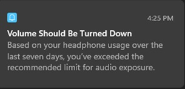

# Technology as a Peer, Not a Parent

I have barely used headphones in weeks, partly because I am tired of devices that talk at me when I never asked. Somewhere along the way, we normalized software making suggestions as if it has authority over its user.

The problem is not one notification. The problem is the pattern. Once operating systems and apps are allowed to constantly "advise" us, it becomes easier to justify deeper behavior changes that happen without clear consent.

Then the ground shifts under people who rely on stable tools. A workflow that works today can quietly break tomorrow because a platform decided to enforce a new rule, hide a setting, or remove an option.

I know the common defense: "We couldn't predict every side effect." But systems design has always required anticipating interactions across components. Low-probability impacts still matter when they affect real users in production.

If we want trustworthy technology, we need to treat users as owners, not passengers. That means transparent changes, reversible defaults, and real respect for consent before deployment.
